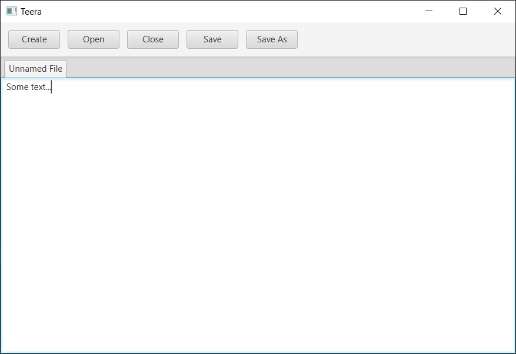
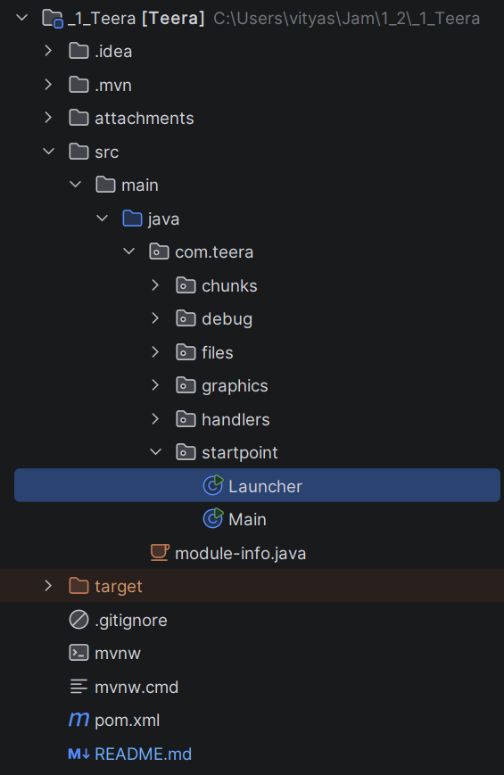
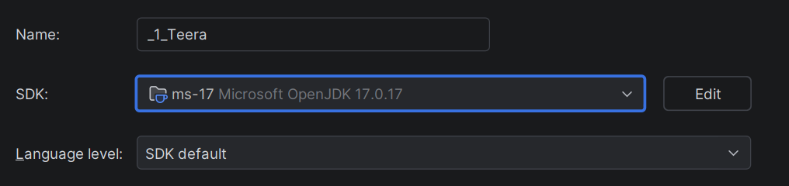
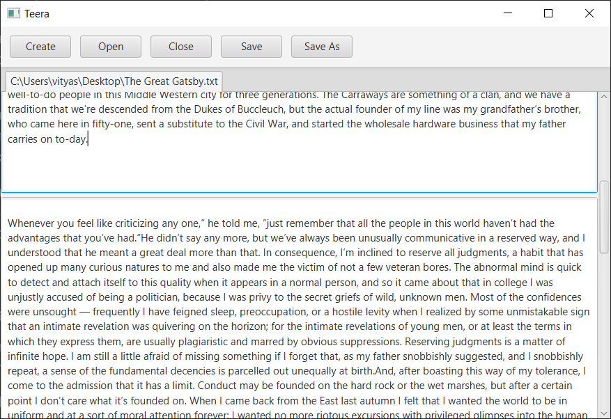
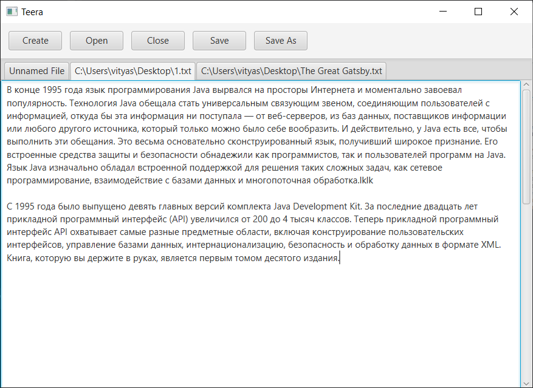

### Teera
A simple editor (study project) for text files.

#### Quick start (git clone)
1. Clone this repository with Git (or GitHub Desktop)
~~~
git clone https://github.com/tarqa-a-flyweight/_1_Teera.git <your target dir>
~~~
2. Open dir as project in your IDE and run Launcher (src.main.java.com.teera.startpoint)

  

3. 
The project is based on Java 17, so if you get a compilation error, please low the language level and rebuild project.

  

#### Gallery

